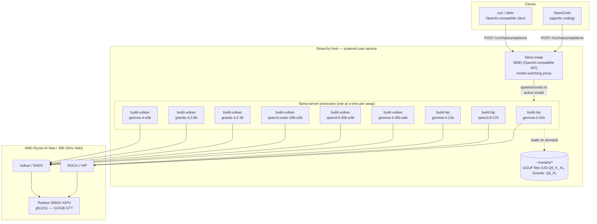

# Local LLM on Strix Halo (Omarchy) — Setup Guide

Target hardware: AMD Ryzen AI Max+ (Strix Halo, gfx1151), 128GB unified RAM, Omarchy (Arch-based, Hyprland).
Goal: run local models via llama.cpp, reliably GPU-accelerated (Vulkan and/or ROCm), served through
llama-swap for model-switching, with an OpenCode client wired up for agentic coding.

## Models

| Model | Repo | Type | Role |
|---|---|---|---|
| Gemma 4 31B | `unsloth/gemma-4-31B-it-GGUF` | Dense transformer | General daily driver |
| Gemma 4 26B-A4B | `unsloth/gemma-4-26B-A4B-it-GGUF` | MoE (25.2B total / 3.8B active), vision-capable | Fast general-purpose |
| Qwen3.6-35B-A3B | `unsloth/Qwen3.6-35B-A3B-GGUF` | MoE, hybrid Gated-DeltaNet + Attention | High-quality general purpose |
| Qwen3.8-27B | `unsloth/Qwen3.8-27B-GGUF` | Hybrid Gated-DeltaNet + Attention, vision-capable | General purpose, vision |
| Qwen3-Coder-30B-A3B | `unsloth/Qwen3-Coder-30B-A3B-Instruct-GGUF` | Plain MoE | Tool-calling / OpenCode driver |
| Granite 4.2 3B | `ibm-granite/granite-4.2-3b-GGUF` | Dense transformer (reasoning) | Small/fast general-purpose |
| Granite 4.2 8B | `ibm-granite/granite-4.2-8b-GGUF` | Dense transformer (reasoning) | Mid-size general-purpose |
| Gemma 4 12B | `unsloth/gemma-4-12b-it-GGUF` | Dense transformer | Small/fast dense Gemma (no dense 8B exists in this lineup — closest size) |
| Gemma 4 E4B | `unsloth/gemma-4-E4B-it-GGUF` | Dense transformer (elastic, 7.52B params) | Small/fast dense Gemma — closest actual param count to "8B" |

All GGUFs are from `unsloth`, quantized at `UD-Q6_K_XL` (Unsloth Dynamic mixed-precision quant,
~25-30GB per model). With 128GB unified RAM this leaves generous headroom for KV cache. Use Q8_0 if
quality matters more than headroom, or Q4_K_M to run two models loaded simultaneously.

**Exception — Granite 4.2:** as of 2026-09-14, `unsloth` has not published GGUF quants for
granite-4.2. Both Granite models use IBM's own official GGUF repos instead
(`ibm-granite/granite-4.2-{3b,8b}-GGUF`), at the plain `Q6_K` quant — the closest match to the
`UD-Q6_K_XL` quality level available for this family.

Qwen3.6-35B-A3B and Qwen3.8-27B use Qwen's hybrid Gated-DeltaNet + Attention architecture. On a
current (tip-of-main) llama.cpp build, `GATED_DELTA_NET` is GPU-accelerated on both Vulkan and
ROCm/HIP — no CPU fallback. This is why Phase 3 builds from source rather than a packaged release:
gfx1151 kernel work and DeltaNet support are landing continuously upstream, and a stale release may
not have them.

## Architecture



`llama-swap` is the only long-running process — it starts/stops the right `llama-server` binary
(Vulkan or ROCm build, per model) on demand, so only one model is loaded in GPU memory at a time.
Clients only ever talk to port 8080; they never address a `llama-server` directly.

---

## Phase 0 — Baseline check

```bash
uname -r                     # want a recent kernel (≥6.16)
lscpu | grep Model            # confirm Ryzen AI Max / Strix Halo
free -h                       # confirm ~128GB visible
```

Note: on recent kernel/amdgpu driver versions, the GTT/VRAM sysfs files are named
`mem_info_gtt_total` / `mem_info_vram_total` (no `_bytes` suffix). Find your card's sysfs path
(usually `/sys/class/drm/card1/device/`, but confirm — `card0` may not exist if there's only an
iGPU).

## Phase 1 — BIOS + memory (GTT) config

1. Confirm the BIOS iGPU UMA/frame-buffer carve-out is minimal (check
   `mem_info_vram_total` — should read close to 1GB, not several GB). If your BIOS has a large
   fixed carve-out, reduce it there first.

2. Raise the GTT (GPU-accessible system memory) ceiling — the kernel default is roughly half of
   RAM, too small for a 30B+ model plus KV cache alongside a desktop session.

   **On Omarchy** (Limine bootloader, signed UKI, Secure Boot, Btrfs/Snapper), the kernel cmdline
   is *not* set via `/etc/kernel/cmdline` — that file is ignored when Secure Boot + Snapper are
   both active, because a signed UKI with a baked-in cmdline can't boot arbitrary Btrfs snapshots.
   Instead, cmdline params go in a drop-in read by `limine-entry-tool`:
   ```bash
   echo 'KERNEL_CMDLINE[default]+=amdgpu.gttsize=114688 ttm.pages_limit=29360128' \
     | sudo tee /etc/limine-entry-tool.d/99-strix-halo-gtt.conf
   sudo limine-mkinitcpio
   ```
   (`114688` MiB ≈ 112GiB, leaving ~12GiB headroom out of 124GiB visible RAM for OS + desktop —
   adjust to taste. `ttm.pages_limit` is the same figure in 4KiB pages: MiB × 1024 ÷ 4 = pages;
   `amdgpu.gttsize` is being deprecated in favor of it on newer kernels, so both are set.)

   `sudo limine-mkinitcpio` rebuilds and re-signs the UKI (its own `sbctl` post-hook handles
   signing) and updates `/boot/limine.conf` automatically.

   (On a non-Omarchy / systemd-boot / GRUB system, the equivalent is just editing
   `/etc/kernel/cmdline` or your bootloader's kernel parameters directly, then regenerating.)

3. **Verify before rebooting:**
   ```bash
   grep amdgpu.gttsize /boot/limine.conf   # confirm the params landed in the cmdline: line
   sudo sbctl verify                        # confirm the rebuilt UKI is still signed
   ```

4. Reboot, then confirm:
   ```bash
   cat /proc/cmdline
   cat /sys/class/drm/card1/device/mem_info_gtt_total | numfmt --to=iec
   ```
   `/proc/cmdline` should include `amdgpu.gttsize=114688 ttm.pages_limit=29360128`, and
   `mem_info_gtt_total` should read close to 112G.

## Phase 2 — Install GPU stack (both backends, so you can benchmark)

```bash
# Vulkan (RADV, via mesa)
sudo pacman -S vulkan-radeon vulkan-tools vulkan-icd-loader mesa

# Vulkan shader toolchain — required by llama.cpp's Vulkan build
# (ggml-vulkan's CMakeLists does find_package(SPIRV-Headers); without this, Phase 3's Vulkan
# cmake configure fails with "Could not find a package configuration file provided by SPIRV-Headers")
sudo pacman -S spirv-headers spirv-tools shaderc

# ROCm/HIP
sudo pacman -S rocm-hip-sdk rocm-smi-lib rocminfo

# build tools + GPU monitor
sudo pacman -S cmake ninja git base-devel amdgpu_top
```

**Verify Vulkan sees the GPU:**
```bash
vulkaninfo --summary
```
Expect a `Radeon 8060S` / `RADV STRIX_HALO` device listed under `Devices:`.

**Verify ROCm sees the GPU:**
```bash
rocminfo | grep -i gfx
```
Expect `gfx1151`. If not detected, try `export HSA_OVERRIDE_GFX_VERSION=11.5.1`, or fall back to
the AUR `rocm-gfx1151-bin` package for better gfx1151 kernel coverage.

## Phase 3 — Build llama.cpp (from source, tip of main)

```bash
git clone https://github.com/ggml-org/llama.cpp ~/llama.cpp
cd ~/llama.cpp
```

**Vulkan build:**
```bash
cmake -B build-vulkan -DGGML_VULKAN=ON -DCMAKE_BUILD_TYPE=Release
cmake --build build-vulkan --config Release -j$(nproc)
```

**ROCm/HIP build:**
```bash
cmake -B build-hip -DGGML_HIP=ON -DAMDGPU_TARGETS=gfx1151 \
  -DCMAKE_BUILD_TYPE=Release -DGGML_HIP_ROCWMMA_FATTN=ON
cmake --build build-hip --config Release -j$(nproc)
```

**Verify both built:**
```bash
./build-vulkan/bin/llama-cli --version
./build-hip/bin/llama-cli --version
```

## Phase 4 — Sanity-check the pipeline

**Tooling:** model downloads use the `hf` CLI (from `huggingface_hub`), run ephemerally via `uv`
rather than installed into the system Python:
```bash
uvx --from "huggingface_hub" hf download <repo> --include "<exact-filename>" --local-dir <dir>
```
`uvx` caches the resolved environment, so repeated calls are fast after the first.

Grab a small dense model to confirm the build works before pulling the large target models:
```bash
uvx --from "huggingface_hub" hf download bartowski/Qwen2.5-7B-Instruct-GGUF \
  --include "*Q4_K_M*" --local-dir ~/models/qwen2.5-7b-test

./build-vulkan/bin/llama-bench -m ~/models/qwen2.5-7b-test/*.gguf -ngl 999 -fa 1
./build-hip/bin/llama-bench -m ~/models/qwen2.5-7b-test/*.gguf -ngl 999 -fa 1
```

**Verify GPU (not CPU) is doing the work** — run `amdgpu_top` in a second terminal while the bench
runs. GPU busy% should be near 100 with low CPU core usage.

As a rule of thumb, ROCm/HIP tends to win prompt-processing (prefill), Vulkan tends to be
competitive or better on token generation — but this varies per model, so benchmark each of the
real target models individually before picking a backend for it in the serving config (Phase 6).

## Phase 5 — Download the models

**Before downloading, check each repo's exact file list.** Unsloth repos commonly ship both a
plain quant (`Q6_K.gguf`) and their own dynamic mixed-precision quant at the same nominal level
(`UD-Q6_K_XL.gguf`, sometimes also `UD-Q6_K.gguf`, `UD-Q6_K_L.gguf`, `UD-Q6_K_M.gguf`) — a wildcard
like `--include "*Q6_K*"` matches all of them and wastes bandwidth/disk on duplicates. Use the
exact filename from the repo's file listing. Prefer the `UD-*` dynamic quant when both exist —
generally better quality at the same nominal bit-width.

```bash
# Gemma 4 31B
uvx --from "huggingface_hub" hf download unsloth/gemma-4-31B-it-GGUF \
  --include "gemma-4-31B-it-UD-Q6_K_XL.gguf" --local-dir ~/models/gemma-4-31b

# Gemma 4 26B-A4B
uvx --from "huggingface_hub" hf download unsloth/gemma-4-26B-A4B-it-GGUF \
  --include "gemma-4-26B-A4B-it-UD-Q6_K_XL.gguf" --local-dir ~/models/gemma-4-26b-a4b

# Qwen3.6-35B-A3B
uvx --from "huggingface_hub" hf download unsloth/Qwen3.6-35B-A3B-GGUF \
  --include "Qwen3.6-35B-A3B-UD-Q6_K_XL.gguf" --local-dir ~/models/qwen3.6-35b-a3b

# Qwen3.8-27B
uvx --from "huggingface_hub" hf download unsloth/Qwen3.8-27B-GGUF \
  --include "Qwen3.8-27B-UD-Q6_K_XL.gguf" --local-dir ~/models/qwen3.8-27b

# Qwen3-Coder-30B-A3B (tool-calling model for OpenCode — see Phase 7)
uvx --from "huggingface_hub" hf download unsloth/Qwen3-Coder-30B-A3B-Instruct-GGUF \
  --include "Qwen3-Coder-30B-A3B-Instruct-UD-Q6_K_XL.gguf" --local-dir ~/models/qwen3-coder-30b-a3b

# Granite 4.2 3B (IBM official GGUF repo — no unsloth quant available as of 2026-09-14)
uvx --from "huggingface_hub" hf download ibm-granite/granite-4.2-3b-GGUF \
  --include "granite-4.2-3b-Q6_K.gguf" --local-dir ~/models/granite-4.2-3b

# Granite 4.2 8B (IBM official GGUF repo — no unsloth quant available as of 2026-09-14)
uvx --from "huggingface_hub" hf download ibm-granite/granite-4.2-8b-GGUF \
  --include "granite-4.2-8b-Q6_K.gguf" --local-dir ~/models/granite-4.2-8b

# Gemma 4 12B (small/fast dense Gemma — no dense 8B exists in the Gemma 4 lineup)
uvx --from "huggingface_hub" hf download unsloth/gemma-4-12b-it-GGUF \
  --include "gemma-4-12b-it-UD-Q6_K_XL.gguf" --local-dir ~/models/gemma-4-12b

# Gemma 4 E4B (elastic dense, 7.52B params — closest actual param count to "8B")
uvx --from "huggingface_hub" hf download unsloth/gemma-4-E4B-it-GGUF \
  --include "gemma-4-E4B-it-UD-Q6_K_XL.gguf" --local-dir ~/models/gemma-4-e4b
```

**Verify:** `hf download` resumes/verifies checksums automatically; sanity-check each file size
against the repo's listed size, and confirm only one `.gguf` landed per directory.

**Benchmark each model on both backends** to pick which to serve it with in Phase 6:
```bash
./build-vulkan/bin/llama-bench -m <path-to-model.gguf> -ngl 999 -fa 1
./build-hip/bin/llama-bench -m <path-to-model.gguf> -ngl 999 -fa 1
```
On this hardware/build, the backend picks below were: Gemma 4 31B → HIP (wins prefill by ~33%, tied
on generation), Gemma 4 26B-A4B → Vulkan (wins generation by ~11%), Qwen3.6-35B-A3B → Vulkan (wins
both prefill and generation), Qwen3.8-27B → HIP (wins prefill by ~66%, tied on generation),
Qwen3-Coder-30B-A3B → Vulkan (wins both prefill and generation), Granite 4.2 3B → Vulkan (wins both
prefill and generation), Granite 4.2 8B → Vulkan (wins both prefill and generation), Gemma 4 12B →
HIP (wins prefill by ~20%, gen tied), Gemma 4 E4B → Vulkan (wins prefill by ~23%, gen by ~6%). See
`record.md` for the full benchmark data.

## Phase 6 — Serve with model-switching (llama-swap)

Install llama-swap (single static Go binary). Release asset filenames embed the version number
(e.g. `llama-swap_255_linux_amd64.tar.gz`), so resolve the current asset URL via the GitHub API
rather than guessing a static filename:
```bash
mkdir -p ~/bin && cd ~/bin
url=$(curl -s https://api.github.com/repos/mostlygeek/llama-swap/releases/latest \
  | grep -o '"browser_download_url": *"[^"]*linux_amd64\.tar\.gz"' | cut -d'"' -f4)
curl -L -o llama-swap.tar.gz "$url"
tar xzf llama-swap.tar.gz && chmod +x llama-swap
```

Config (`~/.config/llama-swap/config.yaml`) — backend (`build-vulkan`/`build-hip`) per model chosen
from Phase 5's benchmarks:
```yaml
models:
  gemma-4-31b:
    cmd: >
      ~/llama.cpp/build-hip/bin/llama-server
      --model ~/models/gemma-4-31b/gemma-4-31B-it-UD-Q6_K_XL.gguf
      --port ${PORT} -ngl 999 -fa 1 -c 262144

  gemma-4-26b-a4b:
    cmd: >
      ~/llama.cpp/build-vulkan/bin/llama-server
      --model ~/models/gemma-4-26b-a4b/gemma-4-26B-A4B-it-UD-Q6_K_XL.gguf
      --port ${PORT} -ngl 999 -fa 1 -c 262144

  qwen3.6-35b-a3b:
    cmd: >
      ~/llama.cpp/build-vulkan/bin/llama-server
      --model ~/models/qwen3.6-35b-a3b/Qwen3.6-35B-A3B-UD-Q6_K_XL.gguf
      --port ${PORT} -ngl 999 -fa 1 -c 262144 --cache-type-k q8_0 --cache-type-v q8_0

  qwen3.8-27b:
    cmd: >
      ~/llama.cpp/build-hip/bin/llama-server
      --model ~/models/qwen3.8-27b/Qwen3.8-27B-UD-Q6_K_XL.gguf
      --port ${PORT} -ngl 999 -fa 1 -c 262144 --cache-type-k q8_0 --cache-type-v q8_0

  qwen3-coder-30b-a3b:
    cmd: >
      ~/llama.cpp/build-vulkan/bin/llama-server
      --model ~/models/qwen3-coder-30b-a3b/Qwen3-Coder-30B-A3B-Instruct-UD-Q6_K_XL.gguf
      --port ${PORT} -ngl 999 -fa 1 -c 262144

  granite-4.2-3b:
    cmd: >
      ~/llama.cpp/build-vulkan/bin/llama-server
      --model ~/models/granite-4.2-3b/granite-4.2-3b-Q6_K.gguf
      --port ${PORT} -ngl 999 -fa 1 -c 131072

  granite-4.2-8b:
    cmd: >
      ~/llama.cpp/build-vulkan/bin/llama-server
      --model ~/models/granite-4.2-8b/granite-4.2-8b-Q6_K.gguf
      --port ${PORT} -ngl 999 -fa 1 -c 131072

  gemma-4-12b:
    cmd: >
      ~/llama.cpp/build-hip/bin/llama-server
      --model ~/models/gemma-4-12b/gemma-4-12b-it-UD-Q6_K_XL.gguf
      --port ${PORT} -ngl 999 -fa 1 -c 262144

  gemma-4-e4b:
    cmd: >
      ~/llama.cpp/build-vulkan/bin/llama-server
      --model ~/models/gemma-4-e4b/gemma-4-E4B-it-UD-Q6_K_XL.gguf
      --port ${PORT} -ngl 999 -fa 1 -c 131072
```
Contexts are set to each model's full native training length (`n_ctx_train = 262144` for the
original five, per GGUF metadata). An empirical sweep (2026-09-09) confirmed this box's 112GiB GTT /
124GiB RAM is not the constraint: every model loads and serves at full 262144 context with GPU-bound
headroom to spare (worst case, Gemma 4 31B, used only ~50GiB GTT / 63GiB RAM at max context — see
`record.md` for the full per-model numbers). The old lower `-c` values were a leftover caution, not a
measured limit; raise past 262144 only via RoPE/YaRN context extension if needed, which trades
quality for length and wasn't covered by this sweep.

The two Granite 4.2 models have a smaller native context (`n_ctx_train = 131072`, per GGUF metadata)
and are set to their own native max — well within the headroom the sweep already established, so no
separate sweep was run for them.

Gemma 4 12B shares the 262144 native context of the rest of the Gemma 4 / Qwen family; Gemma 4 E4B's
native context is 131072 (same as the Granite models) — both set to their own native max, same
reasoning as above.

Run it: `~/bin/llama-swap --config ~/.config/llama-swap/config.yaml --listen :8080`

**Verify:**
```bash
curl -s localhost:8080/v1/models | jq
curl -s localhost:8080/v1/chat/completions -H 'Content-Type: application/json' \
  -d '{"model":"gemma-4-31b","messages":[{"role":"user","content":"say hi"}]}'
```
Watch `amdgpu_top` during that request — GPU busy%, not CPU, should spike.

Once confirmed, wrap it as a systemd **user** service so it survives reboot
(`~/.config/systemd/user/llama-swap.service`):
```ini
[Unit]
Description=llama-swap (llama.cpp model-switching proxy)
After=network.target

[Service]
Type=simple
ExecStart=%h/bin/llama-swap --config %h/.config/llama-swap/config.yaml --listen :8080
Restart=on-failure
RestartSec=3

[Install]
WantedBy=default.target
```
```bash
systemctl --user daemon-reload
systemctl --user enable --now llama-swap
```

**To also survive a full logout** (not just reboot-then-login), enable lingering so your user's
systemd instance keeps running without an active session:
```bash
sudo loginctl enable-linger $(whoami)
```
Without this, the service is correctly `enable`d and will start on next login/reboot, but stops if
you log out fully without rebooting.

By default llama-swap binds `:8080` (all interfaces), not just loopback — it logs a warning about
this on startup. Add `--listen localhost:8080` to the `ExecStart` line above if you don't want the
server reachable from other hosts on your network.

## Phase 7 — Point a client at it

Any OpenAI-compatible client works against `http://localhost:8080/v1`. For a chat UI, Open WebUI is
the common pairing.

### OpenCode

[OpenCode](https://opencode.ai) supports arbitrary OpenAI-compatible endpoints via the
`@ai-sdk/openai-compatible` provider adapter — llama-swap's `/v1` endpoint works directly, no API
key needed for a local deployment.

Add a provider block to `opencode.json` (project-local) or `~/.config/opencode/opencode.json`
(global):
```json
{
  "$schema": "https://opencode.ai/config.json",
  "provider": {
    "llama.cpp": {
      "npm": "@ai-sdk/openai-compatible",
      "name": "llama-swap (local)",
      "options": {
        "baseURL": "http://127.0.0.1:8080/v1"
      },
      "models": {
        "gemma-4-31b": {
          "name": "Gemma 4 31B (local)",
          "limit": { "context": 262144, "output": 8192 }
        },
        "gemma-4-26b-a4b": {
          "name": "Gemma 4 26B-A4B MoE (local)",
          "limit": { "context": 262144, "output": 8192 }
        },
        "qwen3.6-35b-a3b": {
          "name": "Qwen3.6-35B-A3B MoE (local)",
          "limit": { "context": 262144, "output": 8192 }
        },
        "qwen3.8-27b": {
          "name": "Qwen3.8-27B (local)",
          "limit": { "context": 262144, "output": 8192 }
        },
        "qwen3-coder-30b-a3b": {
          "name": "Qwen3-Coder-30B-A3B (local)",
          "limit": { "context": 262144, "output": 8192 }
        },
        "granite-4.2-3b": {
          "name": "Granite 4.2 3B (local)",
          "limit": { "context": 131072, "output": 8192 }
        },
        "granite-4.2-8b": {
          "name": "Granite 4.2 8B (local)",
          "limit": { "context": 131072, "output": 8192 }
        },
        "gemma-4-12b": {
          "name": "Gemma 4 12B (local)",
          "limit": { "context": 262144, "output": 8192 }
        },
        "gemma-4-e4b": {
          "name": "Gemma 4 E4B (local)",
          "limit": { "context": 131072, "output": 8192 }
        }
      }
    }
  }
}
```
The keys under `models` must exactly match the model names llama-swap advertises (from
`config.yaml`'s `models:` keys) — verify with `curl -s localhost:8080/v1/models | jq` before
relying on this; a mismatched ID gets a 404 from llama-swap instead of a response.

`limit.context`/`limit.output` should match (or stay under) each model's actual served `-c` size
from `config.yaml` — 262144 (native max) for the original five plus Gemma 4 12B, 131072 (native max)
for the two Granite 4.2 models plus Gemma 4 E4B; not resource-constrained on this hardware, see the
context-window sweep note above and `record.md`.

For tool-calling-heavy OpenCode sessions (agentic edits, running commands), use
**`qwen3-coder-30b-a3b`** — it's the model in this set built specifically for tool use.

---

## Expected results

- **Gemma 4 31B**: clean, consistent GPU-bound inference. Reliable general-purpose daily driver.
- **Gemma 4 26B-A4B**: clean GPU-bound MoE inference, several times the throughput of the dense 31B
  model on this bandwidth-limited iGPU — prefer it over the dense model when quality is comparable.
- **Qwen3.6-35B-A3B / Qwen3.8-27B**: on a current llama.cpp build, both backends GPU-accelerate the
  Gated-DeltaNet layers cleanly — no CPU fallback. Qwen3.6-35B-A3B is sparse MoE (fast, favors
  Vulkan); Qwen3.8-27B has little/no MoE sparsity, so its throughput sits in the same range as the
  dense Gemma 4 31B (favors HIP). Re-run `llama-bench` after future `git pull && rebuild` cycles on
  llama.cpp to catch any regression, since gfx1151 kernel work is still active upstream.
- **Qwen3-Coder-30B-A3B**: plain MoE, confirmed the best generation throughput of any model on
  this machine (66.75 t/s on Vulkan). Use it as the tool-calling model for OpenCode.
- **Granite 4.2 3B / 8B**: small dense transformers, clean GPU-bound inference on Vulkan (won both
  prefill and generation on both models). Useful as fast, low-footprint options — e.g. quick
  drafting or a lightweight judge/classifier role — where the larger models' quality isn't needed.
- **Gemma 4 12B / E4B**: added as small/fast dense Gemma options (no dense 8B exists in the Gemma 4
  lineup). 12B follows the usual dense pattern (favors HIP on prefill, tied on generation); E4B
  (7.52B params — the closest actual match to "8B" of anything in this set) favors Vulkan on both
  metrics, like the small Granite models.
